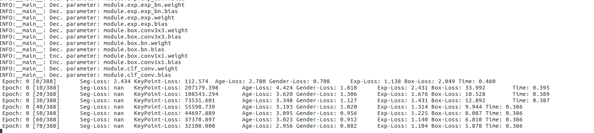
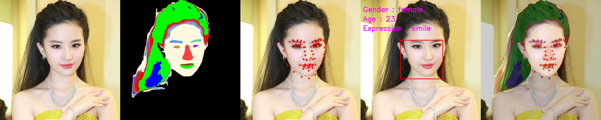
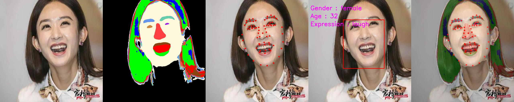

# FaceSegAttribute
This is a unified network for face segmentation,72 landmarks, age, gender, expression, face detection.

The model is trained end to end from the [dataset](https://github.com/midasklr/Face-Dataset)

## Train

Build the helper code for calculating mean IoU written in Cython. For that, execute the following `python src/setup.py build_ext --build-lib=./src/`.

train with resnet50 backbone:

```
python src/train.py --enc 50
```

and you will see:



## Demo

see src/demo.py






